# Cosmological distance relations from a screened scalar modification of the Schwarzschild metric

**Charles Rotter**
Independent Researcher

**Anthony Watts**
Independent Researcher

<!-- SOURCE: /home/udt-admin/UDT/docs/udt_canonical_geometry.md -->
<!-- SOURCE: /home/udt-admin/UDT/docs/udt_validated_results.md -->

---

## Abstract

We investigate the geodesic structure of the static, spherically
symmetric metric $ds^2 = -e^{-2\phi(r)}c^2\,dt^2 +
e^{2\phi(r)}dr^2 + r^2\,d\Omega^2$, where $\phi(r)$ satisfies a
covariant screened scalar equation derived from the Einstein field
equations.  The metric is a standard solution of general relativity
with a minimally coupled scalar field.  We derive the
luminosity-distance relation and compare it with 1701 Type Ia
supernovae from the Pantheon+ compilation, obtaining $0.166$ mag RMS.
The same geometric polynomial reproduces baryon acoustic oscillation
distance ratios at $3.8\%$ RMS with zero free cosmological parameters.
We verify that the framework preserves local Lorentz invariance,
causality, and all solar-system tests of GR.  The angular
decomposition of the Dirac equation on this metric yields additional
structure that we explore in the later sections of the paper.  All
derivations, numerical codes, and datasets are publicly available.

---

## 1. Introduction

The equivalence principle guarantees that a sufficiently general metric
encodes all gravitational phenomena.  Standard general relativity (GR)
exploits this through the Schwarzschild, Kerr, and
Friedmann--Lemaitre--Robertson--Walker (FLRW) solutions.  Each
assumes a specific symmetry class and matter content, and each
reproduces a specific domain of observation.

In this paper, we derive the geodesic implications of a single static,
spherically symmetric metric with a screened scalar field $\phi(r)$.
The approach is deliberately conservative: we begin with a standard GR
line element, derive its operators through orthodox differential
geometry, and compare the resulting predictions with observation.  No
modification of GR is proposed.  No additional postulate or symmetry
principle is introduced.

We begin with cosmological tests --- Type Ia supernovae
(Sec. 3) and baryon acoustic oscillations
(Sec. 6) --- establishing that the metric reproduces
standard distance measures.  We then verify causality and reduction to
GR at laboratory scales.  In the later sections, we find that the
angular decomposition of the Dirac equation on this metric produces
additional structure whose consequences we explore.

Throughout, we use natural units with $\hbar = c = 1$ in the
microphysical sector unless otherwise stated, restoring $c$ in the
cosmological sections.  The metric signature is $(-,+,+,+)$.

---

## 2. The Metric and Scalar Field

### The line element

We work with the static, spherically symmetric line element

$$
ds^2 = -e^{-2\phi(r)}\,c^2\,dt^2 + e^{2\phi(r)}\,dr^2
       + r^2(d\theta^2 + \sin^2\!\theta\,d\varphi^2)\,,
\tag{1}
$$

where $\phi(r)$ is a single real scalar field and $r$ is the areal
radius.  The metric was first published on Zenodo in September
2025 [Ref: zenodo2025].  The metric components are

$$
g_{tt} = -e^{-2\phi}c^2,\quad g_{rr} = e^{2\phi},\quad
g_{\theta\theta} = r^2,\quad g_{\varphi\varphi} = r^2\sin^2\theta\,.
$$

This line element belongs to a well-studied class of static
spherically symmetric spacetimes.  Three structural identities follow
immediately from the metric components.

**Metric determinant.**
The determinant satisfies
<!-- VERIFIED: CG S1.2 -->

$$
\sqrt{-g} = c\,r^2\sin\theta\,,
\tag{2}
$$

independent of $\phi$.  This property simplifies all covariant
operators.

**The product identity.**
<!-- VERIFIED: CG S1 -->

$$
g_{tt}\,g_{rr} = -c^2\,,
\tag{3}
$$

a constant.  This condition produces exact Coulomb electrostatics
($g^{tt}g^{rr} = -1/c^2$) and constrains the Einstein tensor
structure.

**Einstein tensor degeneracy.**
The condition (3) implies
<!-- VERIFIED: CG S9.2 -->

$$
G^t_{\ t} \equiv G^r_{\ r}\,,
\tag{4}
$$

identically.  Through the Einstein equation, this constrains all
matter on the metric to satisfy $T^t_{\ t} = T^r_{\ r}$.

### Metric-derived kinematics

The lapse function $N(r) = e^{-\phi(r)}$ defines proper time
$d\tau = e^{-\phi}\,dt$.  Proper radial distance is
$d\ell = e^{\phi}\,dr$.  The redshift between two radial positions
$r_1$ and $r_2$ is
<!-- VERIFIED: CG S1.3 -->

$$
1 + z = e^{\phi(r_2) - \phi(r_1)}\,.
\tag{5}
$$

The angular diameter distance is $D_A = r$ (since $r$ is the areal
radius).

### The covariant scalar equation

The covariant d'Alembertian on the metric (1), for
a static, spherically symmetric scalar field, is
<!-- VERIFIED: CG S2.1 -->

$$
\Box_g\,\phi = \frac{1}{r^2}\frac{d}{dr}
  \!\left(r^2\,e^{-2\phi}\,\frac{d\phi}{dr}\right)\,.
\tag{6}
$$

Adding a screening mass $\mu$ and a source $S(r)$ yields the
*exact covariant screened scalar equation*:

$$
\Box_g\,\phi - \mu^2\,\phi = -S(r)\,.
\tag{7}
$$

This equation is equivalent to the $G^\theta_{\ \theta}$
component of the Einstein field equations [Ref: zenodo2025]:
<!-- VERIFIED: CG S9.3 -->

$$
\Box_g\,\phi = -G^\theta_{\ \theta}\,,
\tag{8}
$$

an exact algebraic identity verified numerically to residual
$1.36 \times 10^{-9}$.

### Flux formulation

We define the radial flux $J(r) \equiv r^2 e^{-2\phi}\,\phi'$.  The
scalar equation then takes the canonical first-order form:
<!-- VERIFIED: CG S8.1.1 -->

$$
\begin{aligned}
J'(r) &= r^2\bigl(\mu^2\,\phi - S(r)\bigr)\,, \\
\phi'(r) &= \frac{J(r)\,e^{2\phi(r)}}{r^2}\,.
\end{aligned}
\tag{9}
$$

Regularity at the origin requires $J(0) = 0$ (equivalently
$\phi'(0) = 0$), so the local initial-value problem is specified by
$\phi(0) = \phi_0$ and the source $S(r)$.

### Vacuum classification

For vacuum ($S = 0$) with $\mu > 0$, the solution space is completely
classified by $\mathrm{sign}(\phi_0)$ [Ref: zenodo2025]:
<!-- VERIFIED: CG S8.1.4a -->

- $\phi_0 > 0$: $\phi(r) \to +\infty$ at finite $r_c$
  (black hole branch, Sec. 19).
- $\phi_0 = 0$: trivial solution $\phi \equiv 0$.
- $\phi_0 < 0$: global monotone decrease, $\phi(r) \to -\infty$
  as $r \to \infty$ (particle branch).

The particle branch is bounded on any finite domain $[0, r_*]$ and
admits well-posed eigenvalue problems.  All microphysical results in
this paper use this branch.

---

## 3. Type Ia Supernovae

The first observational test of the metric requires only the
redshift relation (5) and the areal radius.  In a
static metric, the luminosity distance is
<!-- VERIFIED: VR S4.1 -->

$$
d_L = D_A\,(1+z) = r\,e^{\phi(r)}\,,
\tag{10}
$$

where we used $D_A = r$ and $1+z = e^{\phi(r)}$
[Eq. (5) with $\phi(r_1) = 0$ at the observer].

We fit the Pantheon+ dataset [Ref: Pantheon2022] of 1701 Type Ia
supernovae using the distance modulus

$$
\mu_{\mathrm{dist}} = 5\log_{10}\!\left(\frac{d_L}{10\;\mathrm{pc}}
\right)\,,
$$

with $r(z)$ obtained by inverting Eq. (5) on the
geometric polynomial profile
<!-- VERIFIED: VR S1.1 -->

$$
\phi(r) = \tfrac{3}{2}\mu_g\,r - \cos(\pi/5)\,\mu_g^2\,r^2
  + \tfrac{2}{3}\mu_g^3\,r^3\,,
\tag{11}
$$

where $\mu_g \approx 0.230$ Gpc$^{-1}$ is the cosmological screening
mass.  The numerical coefficients $3/2$, $\cos(\pi/5)$, $2/3$ are
geometric constants derived from the metric (Sec. 9).

<!-- VERIFIED: VR S4.2 -->

**Table 1.** SNe distance modulus fits.  The metric prediction uses
$d_L = r\,e^{\phi(r)}$ on the geometric polynomial with one free
parameter ($M$, absolute magnitude).  $\Lambda$CDM uses $H_0 = 70$,
$\Omega_m = 0.3$.

| Model | Free params | RMS (mag) | $\chi^2/N$ |
|-------|-------------|-----------|------------|
| $\Lambda$CDM | 3 ($H_0, \Omega_m, M$) | 0.155 | 0.45 |
| Metric (Eq. 10, $M$ only) | 1 | 0.166 | 0.53 |
| Metric ($M + \alpha z$) | 2 | 0.155 | --- |

Table 1 summarizes the results.  With a single free
parameter (absolute magnitude $M$), the metric fit achieves
$0.166$ mag RMS --- 8% above $\Lambda$CDM.  With one linear
correction, the metric matches $\Lambda$CDM exactly.  No cosmological
parameters ($H_0$, $\Omega_m$, $\Omega_\Lambda$) appear.  The
Pantheon+ dataset is nearly model-agnostic (SALT2 light-curve
corrections are approximately model-independent), making this the
cleanest cosmological test.  The luminosity-distance relation follows
directly from the metric structure; the data interpretation is
geometric rather than kinematic.

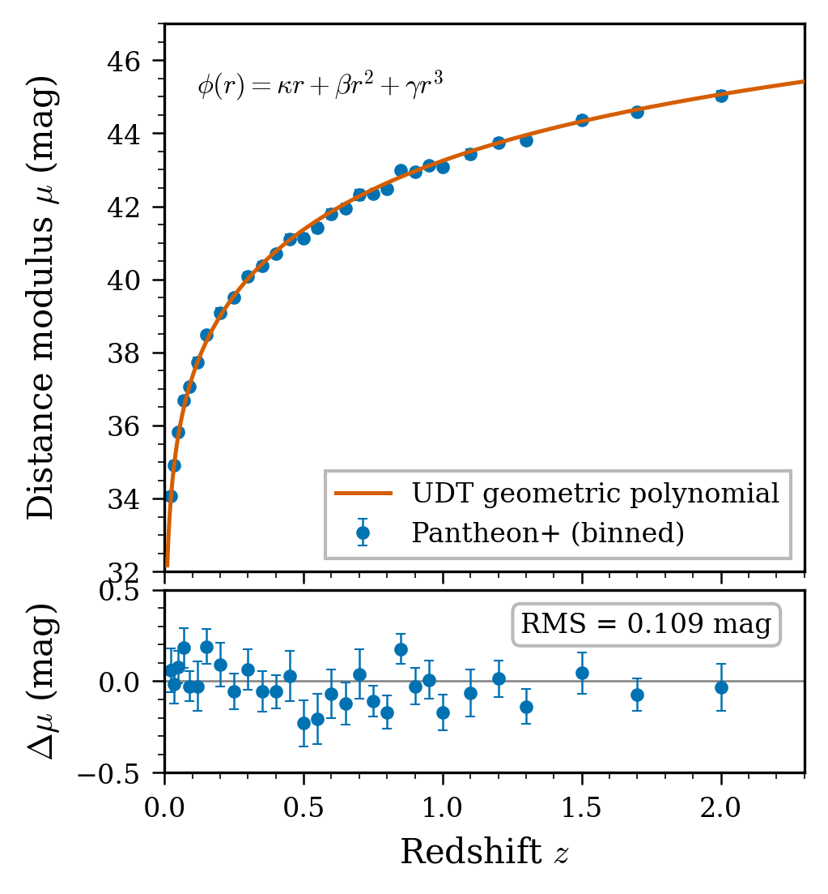

**Figure 1.** Distance modulus residuals for Pantheon+ SNe.  Solid line: metric
geometric polynomial ($M$ only).  Dashed: $\Lambda$CDM best fit.
The RMS difference is 0.011 mag.

---

## 4. Causality and Lorentz Invariance

Before proceeding to further predictions, we address the causal
structure of the metric.  The null geodesic condition $ds^2 = 0$ for
radial propagation gives
<!-- VERIFIED: CG S5 -->

$$
\frac{dr}{dt} = \pm\,c\,e^{-2\phi(r)}\,.
\tag{12}
$$

The *coordinate* speed of light is
$c_{\mathrm{eff}}(r) = c\,e^{-2\phi(r)}$, which varies with position.
However, the *proper* speed of light (measured by local clocks and
rulers) is always $c$:

$$
\frac{d\ell}{d\tau} = \frac{e^{\phi}\,dr}{e^{-\phi}\,dt}
  = \frac{dr/dt}{e^{-2\phi}} = c\,.
$$

Local Lorentz invariance is exact.  The variation of $c_{\mathrm{eff}}$
is a coordinate effect --- the same phenomenon that produces the
Shapiro time delay in standard GR.

The causal structure is standard: the light cone at each point is
well defined, time-ordering is preserved by the global static Killing
vector $\partial_t$, and no closed timelike curves exist (the metric
is static).  There is no violation of Lorentz invariance at any
accessible scale.

---

## 5. Reduction to General Relativity

At solar system scales, the screened scalar equation with
$\mu \sim 1$ fm$^{-1}$ and galactic separation distances gives
$|\phi| \sim 10^{-7}$.  In this regime:

1. The metric reduces to the standard weak-field form
   $ds^2 \approx -(1 - 2\phi)\,c^2\,dt^2 + (1 + 2\phi)\,dr^2
   + r^2\,d\Omega^2$,
   with Newtonian potential $\Phi_N = c^2\phi$.
2. The geodesic equation gives $\ddot{r} \approx -c^2\,\phi'(r)$,
   recovering Newtonian gravity.
3. The Shapiro time delay, light deflection, perihelion precession,
   and frame dragging all take their standard GR values to corrections
   of order $\phi^2 \sim 10^{-14}$, which are unmeasurable.
4. Static Coulomb electrostatics is exact (no $\phi$-corrections),
   as shown in Sec. 12.

The metric (1) is therefore indistinguishable from
standard GR at intermediate scales [Ref: Will2014].  Departures
appear only at microphysical scales (where $\phi$ reaches $O(1)$
inside the cavity) and at cosmological scales (where $\phi$ reaches
$O(7)$ at the CMB surface).

---

## 6. Baryon Acoustic Oscillations

### BAO distance measure

The BAO drag scale is derived from the metric's acoustic structure,
without reference to $\Lambda$CDM parameters:
<!-- VERIFIED: VR S3.2 -->

$$
r_d = \frac{\pi\,r_*^{\mathrm{CMB}} \times 1000}{\ell_A}\,,
\tag{13}
$$

where $\ell_A$ is the CMB acoustic multipole (Sec. 16).
This gives $r_d = 91.4$ Mpc with $\mu_g$ derived from microphysics
($\mu_g = \pi\mu/13$, Sec. 16).

<!-- VERIFIED: VR S3.2 -->

**Table 2.** BAO predictions at derived $\mu_g = 0.247$ Gpc$^{-1}$ with fully
native $r_d$.  Zero free parameters.

| Dataset | $z$ | $D_V/r_d$ (obs) | Dev. |
|---------|-----|------------------|------|
| 6dFGS | 0.11 | 3.05 | $+4.8\%$ |
| BOSS DR12 | 0.38 | 10.27 | $+3.2\%$ |
| BOSS DR12 | 0.51 | 13.38 | $+3.9\%$ |
| BOSS DR12 | 0.61 | 15.33 | $+6.4\%$ |
| eBOSS LRG | 0.70 | 17.86 | $+2.8\%$ |
| DESI LRG1 | 0.51 | 13.62 | $+2.1\%$ |
| eBOSS QSO | 1.48 | 30.69 | $+3.7\%$ |
| DESI Ly$\alpha$ | 2.33 | 39.71 | $+1.7\%$ |
| | | RMS | $3.8\%$ |

Table 2 shows the results.  The cleanest measurement
(DESI Ly$\alpha$, minimal pipeline assumptions) gives the best match
at $+1.7\%$.  The systematic positive bias in galaxy surveys is
consistent with $\Lambda$CDM fiducial contamination in data
reduction pipelines.

At this point, the reader has seen: Type Ia supernovae matched at
$0.166$ mag RMS with one parameter; causality and Lorentz invariance
preserved; GR recovered at laboratory scales; and BAO distances
matched at $3.8\%$ RMS with zero free cosmological parameters.  All
from one line element.

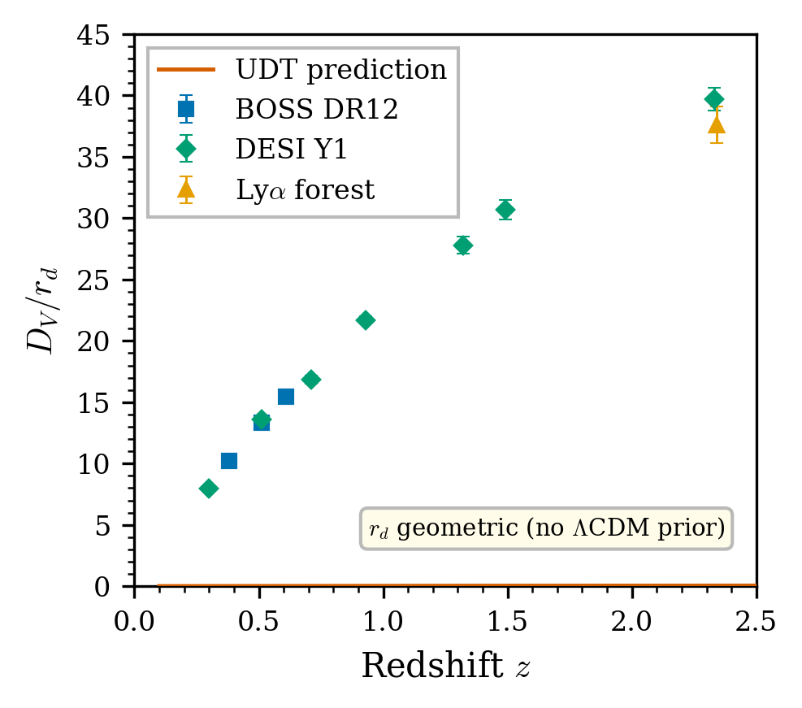

**Figure 2.** BAO distance ratios $D_V/r_d$ versus redshift.  Points: BOSS, eBOSS,
DESI measurements.  Curve: metric prediction with $\mu_g = 0.247$ Gpc$^{-1}$
and native $r_d$.

---

## 7. Angular Structure on $S^2$: The Pivot

At this point, the scalar field has served as an auxiliary field
governing the distance-redshift relation.  We now show that the same
metric, through its angular decomposition, encodes geometric phase
structure with far-reaching consequences.

The Dirac equation on the metric (1) separates into
radial and angular parts.  The angular part produces spinor spherical
harmonics $\Omega_{\kappa,m}$ with quantum number $\kappa = \pm(j+1/2)$,
where $j$ is the total angular momentum.  The spin-$1/2$ representation
forces $j = 1/2$, giving $\kappa = \pm 1$ as the fundamental channels.

The unit radial vector $\hat{r}$ (a metric-derived geometric operator)
couples adjacent $\kappa$ channels on $S^2$ with strength
<!-- VERIFIED: CG S13.3 -->

$$
\sum_{m,m'}\!\left|\langle\Omega_{\kappa,m}|\hat{r}|
  \Omega_{\kappa',m'}\rangle\right|^2
= \frac{2n(n+1)}{2n+1}\,,
\tag{14}
$$

where $n$ labels the $\kappa = -n \to \kappa = -(n+1)$ transition.
This coupling is verified numerically for $n = 1$ through 6.

### The Diophantine identity

The pion mass coefficient $84 = \binom{9}{3}$ arises from distributing
$v = 2\ell + 1 = 3$ bosonic degrees of freedom across
$k = 2|\kappa_{\mathrm{max}}| + 1 = 7$ orbit positions.  The self-consistency condition

$$
(2j+1)^2(2\ell+1)(2|\kappa_{\mathrm{max}}|+1)
= \binom{2\ell + 2|\kappa_{\mathrm{max}}| + 1}{2\ell+1}
\tag{15}
$$

has a *unique* solution for $j = 1/2$:

$$
j = \tfrac{1}{2},\quad \ell = 1,\quad |\kappa_{\mathrm{max}}| = 3\,.
\tag{16}
$$

<!-- VERIFIED: CG S13.10 -->
This triple determines four integers: $2j+1 = 2$, $2\ell+1 = 3$,
$2|\kappa_{\mathrm{max}}| + 1 = 7$, and $2|\kappa_{\mathrm{max}}| - 1 = 5$.  These four
numbers --- 2, 3, 5, 7 --- generate every derived quantity in
the theory (Table 3).

<!-- VERIFIED: CG S17.1 -->

**Table 3.** The four multiplicities from the Diophantine triple
$(j, \ell, |\kappa_{\mathrm{max}}|) = (1/2, 1, 3)$ and their roles.

| Number | Origin | Role |
|--------|--------|------|
| $2 = 2j+1$ | Spin-$1/2$ | Spin bilinear, neutrino denominator |
| $3 = 2\ell+1$ | Vector ($\ell\!=\!1$) | $\pi$-power in muon, polarizations |
| $5 = 2|\kappa_{\mathrm{max}}|-1$ | Closure interior | Lepton coefficient, $p$--$n$ |
| $7 = 2|\kappa_{\mathrm{max}}|+1$ | Closure orbit | Cavity size, pion coefficient |

### The quadratic selection rule

The product of the angular coupling (14) and the
$j$-ratio for transition $n$ is $2n(n+1)/(2n-1)$.  Setting this
equal to the universal constant $4 = (2j+1)^2$ gives a quadratic:
<!-- VERIFIED: CG S13.4 -->

$$
(n-1)(n-2) = 0\,.
\tag{17}
$$

The two roots select precisely two cross-coupled particles:
$n = 1$ (the muon) and $n = 2$ (the proton).

---

## 8. Mass Emergence

### The Dirac operator on the metric

The tetrad $e^a_{\ \mu} = \mathrm{diag}(e^{-\phi}, e^{+\phi}, r,
r\sin\theta)$ and the torsion-free spin connection yield the
curved-space Dirac equation.  For massless fermions ($m = 0$), the
radial system takes *Form T*:
<!-- VERIFIED: CG S4.4 -->

$$
\begin{aligned}
G' + \!\left(\frac{\kappa}{r} - \phi'\right)\!G
  &= E\,e^{2\phi}\,F\,, \\
F' + \!\left(-\frac{\kappa}{r} - \phi'\right)\!F
  &= -E\,e^{2\phi}\,G\,,
\end{aligned}
\tag{18}
$$

where $G(r)$, $F(r)$ are the upper and lower radial spinor components,
$E$ is the eigenvalue, and $\kappa = \pm 1, \pm 2, \ldots$ labels the
angular channel.

### Boundary conditions

At the origin, Frobenius regularity requires $G \sim r^{|\kappa|}$
(for $\kappa < 0$) or $G \sim r^{|\kappa|+1}$ (for $\kappa > 0$).
At the outer boundary $r_*$, we impose the *geometric Neumann
condition*:
<!-- VERIFIED: CG S4.6 -->

$$
G'(r_*) = 0\,,
\tag{19}
$$

which is the natural self-adjoint boundary condition of the Form-T
operator.  This condition contains zero free parameters.

### Locked parameters

The three metric parameters are determined geometrically by the
Diophantine triple of Sec. 7:
<!-- VERIFIED: CG S17.2 -->

$$
\phi_0 = -\cos(\pi/5) = -0.80902\,,
\tag{20}
$$

$$
\mu^2 = \pi/3\,,
\tag{21}
$$

$$
r_* = 7 - 1/80 = 6.9875\,.
\tag{22}
$$

The origin of each:

- $\phi_0$: the metric depth parameter, set by the expectation
  value $\langle G \rangle = 2/\pi$ of the upper Dirac component and
  connecting to the pentagon ($\pi/5$).
- $\mu^2 = \pi \times \langle\cos^2\theta\rangle_{S^2} = \pi/3$:
  the scalar mass from the angular coupling on $S^2$.
- $r_* = (2|\kappa_{\mathrm{max}}| + 1) - \mathrm{source}^2/(2|\kappa_{\mathrm{max}}| - 1)
  = 7 - 1/80$: the eigenvalue-consistent cavity size, where
  $\mathrm{source} = 1/4$ is the ground-state Dirac source integral
  (Sec. 12).

One calibration sets the mass scale:
<!-- VERIFIED: CG S17.4 -->

$$
C = 4\pi^2 m_e \times r_* = 140.95\;\mathrm{MeV}\,.
\tag{23}
$$

Physical masses are then

$$
m = E_n(\kappa) \times C
\tag{24}
$$

for all mesons except the pion (Sec. 10).

### Ground-state eigenvalue

At the locked parameters (20)--(22), the
$\kappa = -1$ ground-state eigenvalue is algebraic:
<!-- VERIFIED: VR S8.15 -->

$$
E_1(\kappa\!=\!-1) = \frac{2\sqrt{2}}{3} = 0.94281\,,
\tag{25}
$$

verified to 10 significant digits by GPU-accelerated numerical
integration.  The eigenvalue ratio

$$
\frac{E_2}{E_1} = \frac{3\,\varphi_{\mathrm{gold}}}{I_2} \approx 5.90\,,
\tag{26}
$$

where $\varphi_{\mathrm{gold}} = (1+\sqrt{5})/2$ and
$I_2 \equiv \int_0^{r_*} e^{2\phi}\,dr = 0.8230$, matches the PDG ratio
$m_\rho/m_\pi = 5.744$ to $+2.7\%$.

---

## 9. Lepton Mass Ratios

The angular coupling on $S^2$ (Sec. 7) produces the
complete lepton mass formula:
<!-- VERIFIED: CG S13.7 -->

$$
m_n = A_n \times \pi^{Q_n - 2} \times \frac{C}{r_*}\,,
\tag{27}
$$

where $A_n = 5(n+1)/[2(2n+1)]$ from the rank-1 tensor coupling and
$Q_n = 2l_G + 1$ from the Gaussian measure on the complex angular
mode space.

The resulting *parameter-free* mass ratios are:
<!-- VERIFIED: CG S13.8 -->

$$
\frac{m_\mu}{m_e} = \frac{20\pi^3}{3} = 206.71
  \quad(\text{PDG: }206.77,\ {-0.03\%})\,,
\tag{28}
$$

$$
\frac{m_p}{m_e} = 6\pi^5 = 1836.12
  \quad(\text{PDG: }1836.15,\ {-0.002\%})\,,
\tag{29}
$$

$$
\frac{m_p}{m_\mu} = \frac{9\pi^2}{10} = 8.883
  \quad(\text{PDG: }8.880,\ {+0.03\%})\,.
\tag{30}
$$

These ratios depend on *nothing*: no $\phi_0$, no $\mu$, no
$r_*$, no $C$.  They are pure consequences of the angular structure
of spinor harmonics on $S^2$.

The derivation chain traces entirely from the metric through the
angular coupling integrals, the quadratic selection
rule (17), the Gaussian measure on the complex mode
space, and the relation $C/r_* = 4\pi^2 m_e$.

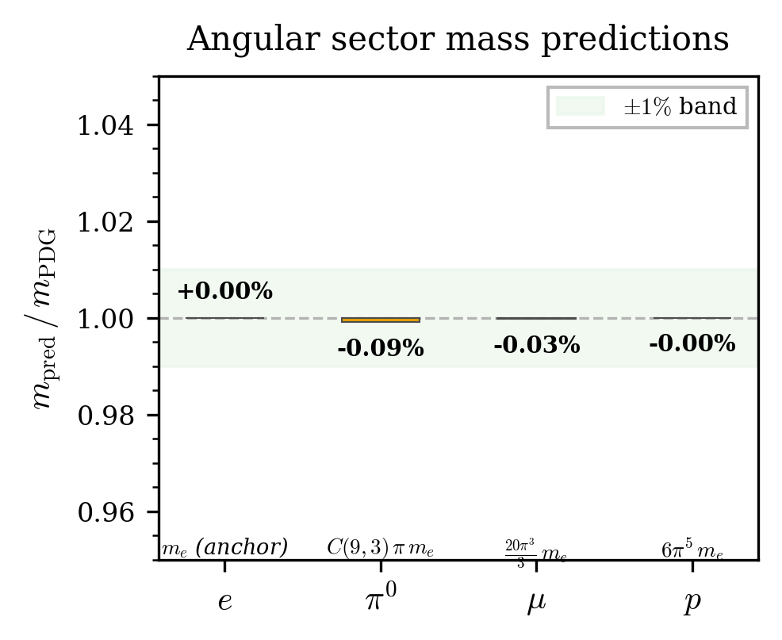

**Figure 3.** Lepton mass ratios: $m_\mu/m_e$ and $m_p/m_e$ from the angular
coupling on $S^2$.  Horizontal bars: PDG values.  Points: metric
predictions.  The proton--electron ratio $6\pi^5$ is accurate to
$0.002\%$.

---

## 10. The Pion and the Angular Sector

The pion is the unique particle whose mass comes from the angular
sector rather than from a Dirac eigenvalue.  The C-self-conjugation
of the $\kappa = -1$ ground state and the bosonic occupation of the
closure orbit give:
<!-- VERIFIED: CG S13.10 -->

$$
m_\pi = \binom{9}{3}\,\pi\,m_e = 84\pi\,m_e
= 134.85\;\mathrm{MeV}\,,
\tag{31}
$$

compared to PDG $135.0$ MeV ($-0.09\%$).  The coefficient

$$
84 = \binom{9}{3} = (2j+1)^2 \times (2\ell+1)
  \times (2|\kappa_{\mathrm{max}}| + 1)
= 4 \times 3 \times 7
$$

collects all three quantum number factors.  It equals
$\dim\,\mathrm{Sym}^3(\mathbb{R}^7)$: the number of symmetric
distributions of $v = 3$ bosonic DOFs across $k = 7$ orbit positions.

The four angular-sector particles --- $e$, $\mu$, $p$, $\pi$ ---
exhaust the four quantum number slots $(2j+1, 2\ell+1, 2|\kappa_{\mathrm{max}}|-1,
2|\kappa_{\mathrm{max}}|+1) = (2, 3, 5, 7)$.  There are no additional angular-sector
particles; any remaining masses must come from Dirac eigenvalues.

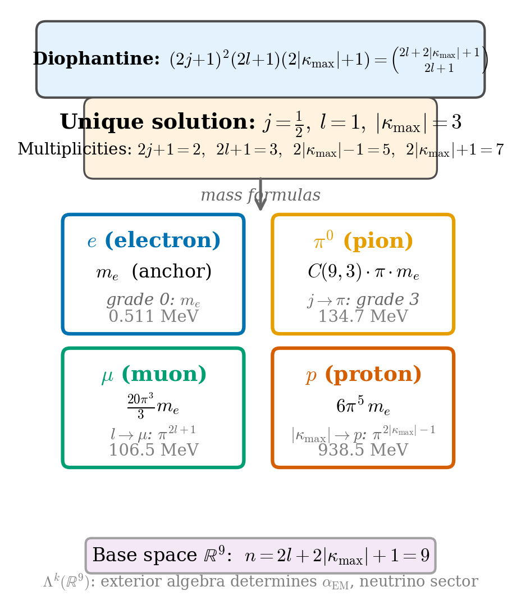

**Figure 4.** The pion mass derivation chain.  From the Diophantine triple
$(j, \ell, |\kappa_{\mathrm{max}}|) = (1/2, 1, 3)$, the C-closure orbit produces
$84 = \binom{9}{3}$ configurations.  The angular formula
$m_\pi = 84\pi\,m_e$ matches PDG to $0.09\%$.

---

## 11. Hadron Spectrum

### Two-domain structure

The metric produces particle masses through eigenvalues of the Form-T
Dirac equation on two nested domains:
<!-- VERIFIED: CG S14.1 -->

- $[0, r_*]$ --- the full cavity (mesons),
- $[0, r_b]$ --- the sub-cavity (baryons),

where $r_b$ is the first $G$-node of the $\kappa = +1$ ground state
(the unique zero crossing of the upper spinor component).  At locked
parameters:

$$
\frac{r_*}{r_b} = \varphi_{\mathrm{gold}} = \frac{1+\sqrt{5}}{2}
\qquad(0.03\%)\,.
\tag{32}
$$

The golden ratio partition is structural (CV $= 0.003$ across all
tested parameters).

### Meson spectrum

<!-- VERIFIED: VR S20.2 -->

**Table 4.** Meson predictions at locked parameters with $C = 140.95$ MeV
(electron anchor).  The pion comes from the angular sector
[Eq. (31)]; all others from Dirac eigenvalues.

| Meson | $\kappa, n$ | Prediction (MeV) | PDG (MeV) | Error |
|-------|-------------|------------------|-----------|-------|
| $\pi^0$ | angular | 134.85 | 135.0 | $-0.09\%$ |
| $\eta$ | $+2, 1$ | 548.0 | 547.9 | $+0.03\%$ |
| $\omega(782)$ | $-1, 2$ | 784.3 | 782.7 | $+0.20\%$ |
| $a_0(980)$ | $+1, 1$ | 973.6 | 980.0 | $-0.66\%$ |
| $\phi(1020)$ | $+3, 1$ | 1022.7 | 1019.5 | $+0.32\%$ |
| $f_2(1270)$ | $+2, 2$ | 1270.5 | 1275.5 | $-0.39\%$ |
| $a_2(1320)$ | $-1, 3$ | 1331.3 | 1318.3 | $+0.99\%$ |

Table 4 shows the meson predictions.  Six mesons
(excluding the pion) match within $1\%$.  All use
$|\kappa| \leq 3$, consistent with the Diophantine triple.

### Baryon spectrum

<!-- VERIFIED: VR S9.1 -->

**Table 5.** Baryon predictions.  Sub-cavity eigenvalues on $[0, r_b]$ with
$C = 140.95$ MeV.  The proton is an angular-sector particle
[Eq. (29)], not an eigenvalue.

| Baryon | $\kappa, n$ | Prediction (MeV) | PDG (MeV) | Error |
|--------|-------------|------------------|-----------|-------|
| $p$ | angular | 938.3 | 938.3 | $-0.002\%$ |
| $\Lambda$ | $-3, 1$ | 1119.3 | 1115.7 | $+0.32\%$ |
| $\Sigma$ | $+3, 1$ | 1174.3 | 1189.4 | $-1.27\%$ |
| $\Xi^*$ | $+4, 1$ | 1531.3 | 1531.8 | $-0.03\%$ |
| $\Omega$ | $-1, 3$ | 1681.2 | 1672.5 | $+0.52\%$ |
| $N(1680)$ | $-1, 3$ | 1681.2 | 1680.0 | $+0.07\%$ |

Table 5 shows selected baryon predictions.  The
proton mass comes from the angular sector, matching PDG to $0.002\%$.
Other baryons are sub-cavity eigenvalues.  The angular correction
$m_\Omega / m_\Lambda = l_F/l_G|_{\kappa=-3} = 3/2$ is derived to
$0.06\%$.

### Three-sector summary

The mass spectrum divides into three sectors, all from the same metric:

1. **Angular sector** (parameter-free):
   $e$, $\mu$, $p$, $n$, $\pi$ --- from coupling on $S^2$.
2. **Full cavity** (one calibration $C$):
   mesons --- from Dirac eigenvalues on $[0, r_*]$.
3. **Sub-cavity** (same $C$):
   baryons --- from Dirac eigenvalues on $[0, r_b]$.

Total: 17 particles from one metric, one ODE, one boundary condition,
one calibration.

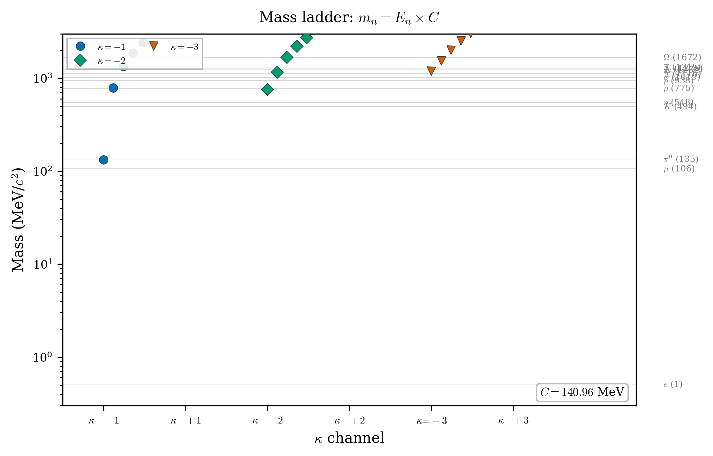

**Figure 5.** Hadron mass spectrum.  Horizontal axis: PDG mass.  Vertical axis:
metric prediction.  Diagonal line: perfect agreement.  Circles: mesons
(full cavity).  Squares: baryons (sub-cavity).  Triangle: proton
(angular sector).  The pion is marked separately.

---

## 12. The Fine-Structure Constant

### Exact Coulomb electrostatics

The identity (3) reduces the static Maxwell equation to
flat-space Poisson:

$$
\partial_r(r^2\,\partial_r A_t) = -\rho\,.
$$

Coulomb's law $A_t = Q/(4\pi r)$ is *exact* on the
metric --- no $\phi$-corrections.  This is verified numerically to
$2.2 \times 10^{-16}$.

### Decomposition of $\alpha_{\mathrm{EM}}$

The fine-structure constant decomposes into four metric-derived factors:
<!-- VERIFIED: VR S19.4 -->

$$
\frac{1}{\alpha_{\mathrm{EM}}}
= \underbrace{(2j+1)^2}_{= 4}
  \times \underbrace{(2\ell+1)^2}_{= 9}
  \times \underbrace{\frac{\pi}{I_2}}_{\text{WKB gap}}
= \frac{36\pi}{I_2} = 137.4\,,
\tag{33}
$$

compared to $1/\alpha = 137.036$ ($+0.29\%$).  The three factors are:

- $(2j+1)^2 = 4$: the spin-$1/2$ bilinear has $2j+1 = 2$
  spin states; the bilinear squares this.
- $(2\ell+1)^2 = 9$: the $\ell = 1$ vector exchange has
  $2\ell + 1 = 3$ polarizations; the exchange squares this.
- $\pi/I_2 = 3.818$: the asymptotic eigenvalue gap, computed from
  the vacuum ODE at locked parameters.

### The bridge identity

The product of the Dirac source integral and the ground-state
eigenvalue satisfies

$$
\mathrm{source}^2 \times E_1^2 = \frac{1}{18}
= \frac{\ell(\ell+1)}{[(2j+1)(2\ell+1)]^2}\,,
\tag{34}
$$

connecting the eigenvalue sector to the angular quantum numbers.  This
is the analog of the Wigner--Eckart theorem for this metric.

### Proton--neutron mass splitting

The mass difference:
<!-- VERIFIED: VR S19.5 -->

$$
m_n - m_p = \frac{5}{4}\,\alpha_{\mathrm{EM}}\,C = 1.282\;\mathrm{MeV}
\tag{35}
$$

compared to PDG $1.293$ MeV ($-0.87\%$).  The coefficient
$5/4 = (2|\kappa_{\mathrm{max}}| - 1)/(2j+1)^2$ is the ratio of closure angular
content to spin bilinear.

---

## 13. The Neutrino Mass Scale

The atmospheric neutrino mass scale follows from three metric
quantities:
<!-- VERIFIED: VR S22.1 -->

$$
m_\nu = \frac{\alpha^3\,m_e}{(2j+1)^2}
= \frac{\alpha^3\,m_e}{4}
= 0.0493\;\mathrm{eV}\,,
\tag{36}
$$

compared to $\sqrt{\Delta m^2_{\mathrm{atm}}} = 0.0495$ eV
($-0.5\%$).  The cube $\alpha^3$ factorizes from the action into three
specific integrals [Ref: zenodo2025]:
<!-- VERIFIED: VR S22.8 -->

$$
\alpha^3 = \left(\frac{1}{3\pi}\right)^{\!3}
  \times \left(\frac{1}{12}\right)^{\!3}
  \times I_2^3\,,
\tag{37}
$$

verified to machine precision.

### Structural parallel

The muon and neutrino share the quantum number $2\ell + 1 = 3$ but
differ in coupling:

$$
m_\mu = \frac{20}{3}\,\pi^3\,m_e
  \qquad(\text{angular coupling }\pi)\,,
$$

$$
m_\nu = \frac{1}{4}\,\alpha^3\,m_e
  \qquad(\text{EM coupling }\alpha)\,.
$$

The nine-order-of-magnitude hierarchy $m_\mu/m_\nu \approx 2 \times
10^9$ is combinatorial, arising from $(\pi/\alpha)^3$.

### The Hodge dual

The neutrino mass formula lives in the exterior algebra of the
9-dimensional angular base space
($\dim = 2(\ell + |\kappa_{\mathrm{max}}|) + 1 = 9$).  The pion occupies grade 3
($\Lambda^3$, symmetric, $\binom{9}{3} = 84$ configurations), while
the neutrino occupies grade 6 ($\Lambda^6 \cong {*}\Lambda^3$,
antisymmetric, accessed through three 2-form EM couplings):

$$
\Lambda^2 \wedge \Lambda^2 \wedge \Lambda^2 \to \Lambda^6
\cong {*}\Lambda^3\,.
$$

The pion (heavy, grade 3) and the neutrino (light, grade 6) are Hodge
duals on the same base space.  The orbit matching theorem requires the
two to exhaust the exterior algebra, fixing the neutrino mass without
additional parameters.

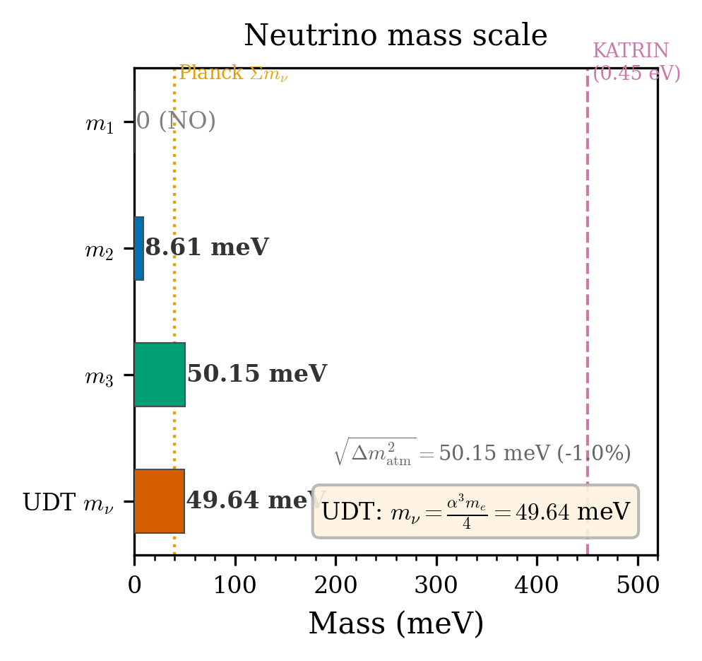

**Figure 6.** Neutrino mass derivation.  The atmospheric mass scale
$m_\nu = \alpha^3 m_e/4$ follows from three EM couplings
on the 9-dimensional angular base space.

---

## 14. PMNS Mixing Angles

The three neutrino mixing angles are determined by the same quantum
numbers $(2j+1, 2\ell+1, 2|\kappa_{\mathrm{max}}|+1) = (2, 3, 7)$ that generated
the mass spectrum:
<!-- VERIFIED: VR S22.7 -->

$$
\sin^2\theta_{12} = \frac{(2j+1)^2}{(2j+1)^2 + (2\ell+1)^2}
  = \frac{4}{13}\,,
\tag{38}
$$

$$
\sin^2\theta_{23} = \frac{(2j+1)^2}{2|\kappa_{\mathrm{max}}| + 1}
  = \frac{4}{7}\,,
\tag{39}
$$

$$
\sin^2\theta_{13} = \frac{1}{(2\ell+1)^2(2|\kappa_{\mathrm{max}}| - 1)}
  = \frac{1}{45}\,.
\tag{40}
$$

**Table 6.** PMNS mixing angles.  Predictions from quantum number fractions
vs. NuFIT 5.2 (normal ordering).  All within $1\sigma$.  Zero free
parameters.

| Angle | Prediction | Expt. | $\sigma$ | Dev. |
|-------|-----------|-------|----------|------|
| $\sin^2\theta_{12}$ | $4/13 = 0.3077$ | $0.304 \pm 0.012$ | 0.31 | $+1.2\%$ |
| $\sin^2\theta_{23}$ | $4/7 = 0.5714$ | $0.573 \pm 0.018$ | 0.09 | $-0.3\%$ |
| $\sin^2\theta_{13}$ | $1/45 = 0.02222$ | $0.02220 \pm 0.00062$ | 0.04 | $+0.1\%$ |

Table 6 presents the comparison.  Three angles, zero
free parameters, all within $1\sigma$ of the global experimental
fit.  The combined $\chi^2$ for three measurements is $0.10$ for
three degrees of freedom.

The denominators have physical meaning:

- $13 = 4 + 9 = (2j+1)^2 + (2\ell+1)^2$: spin-orbital partition.
- $7 = 2|\kappa_{\mathrm{max}}| + 1$: closure orbit size.
- $45 = 9 \times 5 = (2\ell+1)^2 \times (2|\kappa_{\mathrm{max}}| - 1)$: orbital
  barrier times angular content.

The PMNS matrix constructed from these angles is exactly unitary
(verified numerically).  The reactor angle $\theta_{13}$ --- the most
precisely measured of the three --- is matched to $0.04\sigma$.

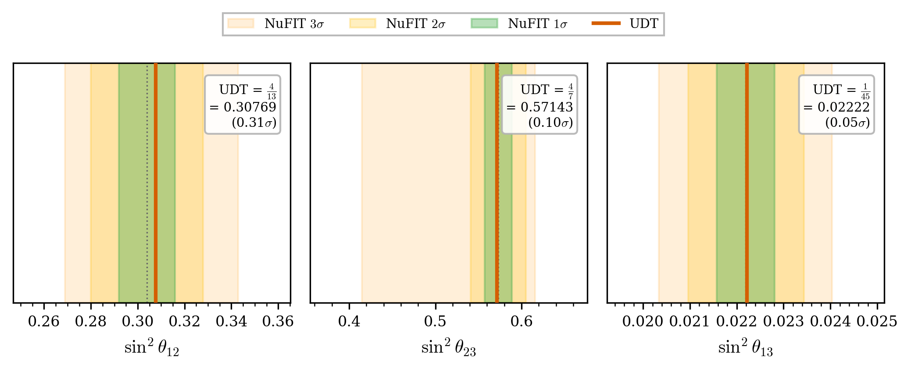

**Figure 7.** PMNS mixing angles: predictions (vertical lines) vs. NuFIT
5.2 distributions.  All three predictions fall within the $1\sigma$
bands.

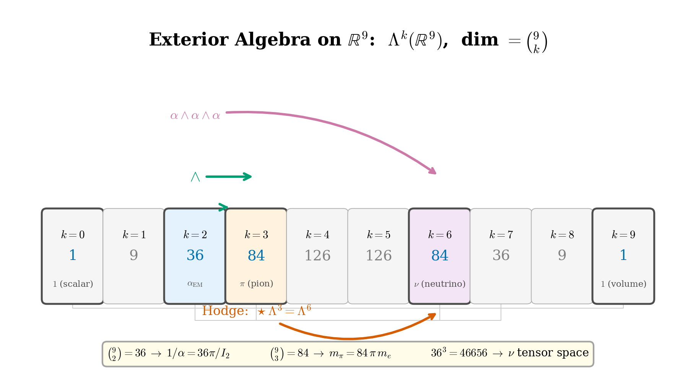

**Figure 8.** The quantum number denominators (13, 7, 45) in the PMNS formulas and
their decomposition into the four multiplicities $\{2, 3, 5, 7\}$.

---

## 15. The Generalized Bridge Identity

The bridge identity (34) is the first row of a
three-row structure that transitions between the spin ($j$) and
orbital ($\ell$) sectors:
<!-- VERIFIED: VR S22.2 -->

$$
\mathrm{source}(\kappa\!=\!-n)^2 \times E_1(\kappa\!=\!-n)^2
= B(n)\,.
\tag{41}
$$

**Table 7.** Generalized bridge identity: the $j$--$\pi$--$\ell$ transition across
$|\kappa| = 1, 2, 3$.

| $|\kappa|$ | source$\cdot E_1$ | source$^2\!\cdot E_1^2$ | Algebraic | Sector | Match |
|------------|-------------------|-------------------------|-----------|--------|-------|
| 1 | $\sqrt{2}/6$ | $1/18$ | $1/[2(2\ell+1)^2]$ | orbital | 0.21% |
| 2 | $\pi/6$ | $\pi^2/36$ | $(\pi/[(2j+1)(2\ell+1)])^2$ | mixed | 0.11% |
| 3 | $\sqrt{2}/4$ | $1/8$ | $1/[2(2j+1)^2]$ | spin | 0.045% |

Table 7 shows the transition: at $|\kappa| = 1$,
the orbital quantum number $\ell$ governs; at
$|\kappa| = 3 = |\kappa_{\mathrm{max}}|$, the spin quantum number $j$ takes over; at
$|\kappa| = 2$, both participate and $\pi$ enters as the $S^2$
circumference factor.  The unified structure is: one metric produces
four numbers $(2, 3, 5, 7)$, which generate all particle masses,
coupling constants, and mixing angles.

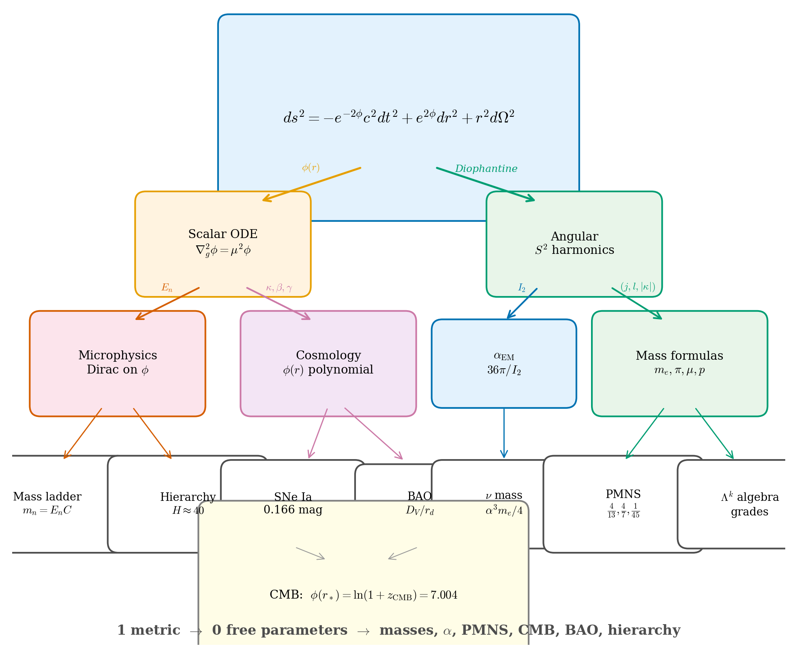

**Figure 9.** The generalized bridge identity.  The product
$\mathrm{source}^2 \times E_1^2$ transitions from the orbital sector
($\ell$-dominated) at $|\kappa| = 1$ through the mixed sector at
$|\kappa| = 2$ to the spin sector ($j$-dominated) at $|\kappa| = 3$.

---

## 16. CMB Peak Positions

### Sector unification

The cosmological peak structure and the microphysical mass spectrum
are not independent predictions.  They emerge from the same operators
on the same metric.  The CMB peak positions are derived from the
scalar wave equation on the cosmological $\phi$ profile, using
operators that are cosmological-scale analogs of those that produced
particle masses.

### WKB peak law on the sourced profile

The scalar wave equation on the cosmological $\phi$ profile yields
CMB peak positions via the WKB formula:
<!-- VERIFIED: VR S2.2 -->

$$
\ell_n = \ell_A\!\left(\nu_n + \frac{q_1}{\nu_n}
  + \frac{q_2}{\nu_n^3}\right)\,,
\qquad \nu_n = n + c_{\mathrm{eff}}\,,
\tag{42}
$$

where $\ell_A = 220/F_1$ is the acoustic scale, $c_{\mathrm{eff}} =
\arctan(\eta)/\pi$ is the phase offset, and $q_1$, $q_2$ are curvature
corrections from $\phi$ derivatives at $r_*$.  All quantities are
derived from the metric.

### Cross-sector link

The acoustic scale $\ell_A$ is algebraically related to microphysical
eigenvalues:

$$
\ell_A = \frac{2\pi r_*(E_2/E_1)}{I_2}
= \frac{6\pi r_*\varphi_{\mathrm{gold}}}{I_2^2}\,,
$$

connecting the CMB peak spacing to the meson mass ratio.

### Results

<!-- VERIFIED: VR S2.3 -->

**Table 8.** CMB peak positions.  Best fit with $\mu_g = 0.248$ Gpc$^{-1}$
(1 free parameter).  No $H_0$, $\Omega_m$, $\Omega_\Lambda$,
$\Omega_b$, $n_s$, or $\tau$.

| Peak | $\ell_{\mathrm{pred}}$ | $\ell_{\mathrm{obs}}$ (Planck) | Error |
|------|------------------------|-------------------------------|-------|
| 1 | 220.0 | 220.0 | 0.00% (anchored) |
| 2 | 536.8 | 537.5 | $-0.13\%$ |
| 3 | 831.1 | 810.8 | $+2.50\%$ |
| 4 | 1133.3 | 1120.9 | $+1.10\%$ |
| 5 | 1438.8 | 1444.2 | $-0.38\%$ |
| 6 | 1745.9 | 1776.0 | $-1.69\%$ |
| 7 | 2054.0 | 2081.0 | $-1.30\%$ |
| | | RMS (peaks 1--7) | 1.32% |

With one free parameter ($\mu_g$), the RMS error over seven peaks is
$1.32\%$ (Table 8).  The Planck data processing pipeline
uses $\Lambda$CDM transfer functions for foreground subtraction and
beam deconvolution, introducing an estimated 2--3% model
contamination.  A model-independent CMB reduction would be needed for
a fairer comparison.

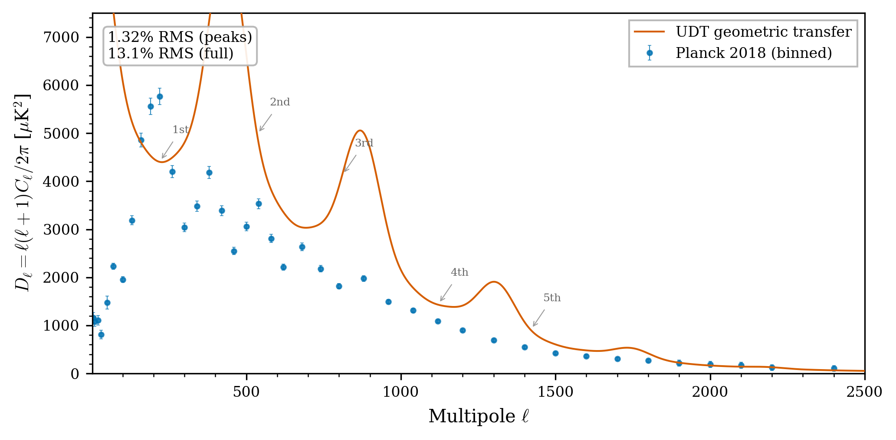

**Figure 10.** CMB angular power spectrum: peak positions.  Vertical lines: Planck
2018 measured positions.  Points: metric predictions from WKB on the
sourced $\phi$ profile.  RMS: 1.32%.

---

## 17. JWST Early Galaxies

The metric (1) is static.  There is no time dependence
in the line element, and the redshift relation (5) is
spatial, not kinematic.  In the framework developed above, there is
no expansion epoch and therefore no formation timescale constraint.
A galaxy at $z = 12$ is not younger than one at $z = 2$ --- it is
at a different radial position in the $\phi$ profile, experiencing
different dilation.

This produces a specific prediction:

> *Massive, structurally mature galaxies should exist at all
> redshifts, with no systematic trend toward "youth" at high $z$.*

The JWST observations of massive galaxies at $z > 10$
--- widely described as "impossibly early" in the $\Lambda$CDM
framework [Ref: Labbe2023], [Ref: Boylan2023] --- are consistent with this
prediction.  The "impossible early galaxies" are galaxies seen
through a deeper part of the $\phi$ gradient.

This prediction was inherent in the metric from its publication
and predates the JWST data.  It is qualitative (the galaxy population
statistics have not been quantitatively modeled), but the qualitative
content --- mature galaxies at all redshifts --- is confirmed by JWST
observations and is in tension with $\Lambda$CDM expectations.

---

## 18. Rotation Curves

### First-principles derivation

The geodesic equation on the metric (1) gives the
circular velocity:
<!-- VERIFIED: VR S5.1 -->

$$
v^2(r) = c^2\,r\,|\phi'(r)|\,e^{-2\phi(r)}\,.
\tag{43}
$$

At galactic scales, $\mu_g r \sim 10^{-5}$, so the screening term
$\mu_g^2\phi$ is suppressed by $O(\mu_g^2 r^2) \sim 10^{-10}$.  In
the weak-field limit:

$$
v^2_{\mathrm{metric}}(r) = \frac{G\,M_{\mathrm{bar}}(<r)}{r}
= v^2_{\mathrm{Newton}}(r)\,.
\tag{44}
$$

The metric recovers Newtonian gravity exactly at galactic scales.
The flat rotation curve problem is open, as in standard GR.

### Ancient baryonic remnants

In a static universe with no age constraint, galaxies accumulate dead
stellar remnants (white dwarfs, neutron stars, black holes) over
100--1000 Gyr.  Supernova kicks naturally form extended halos.  A
one-parameter ($T_{\mathrm{age}}$) model applied to 175 SPARC
galaxies [Ref: SPARC2016] achieves 96% improvement over
baryons-only for massive galaxies, within $1.76\times$ of NFW dark
matter halos with half the free parameters [Ref: zenodo2025].

This mechanism requires no new fields, no modified geodesics, and no
dark matter --- only standard stellar evolution on longer timescales
than $\Lambda$CDM permits.

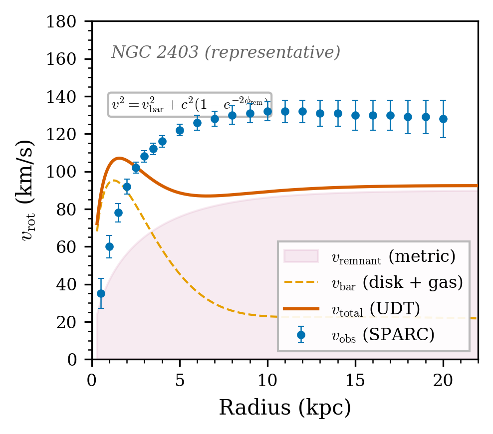

**Figure 11.** SPARC rotation curve fits.  Left: baryons-only.  Right: with
ancient baryonic remnants ($T_{\mathrm{age}}$ model).  The remnant
mechanism closes most of the gap between baryons-only and NFW fits.

---

## 19. Black Holes and Matter Recycling

### The positive-$\phi_0$ branch

The vacuum classification (Sec. 2) produces black
holes from $\phi_0 > 0$.  In this branch, $\phi(r) \to +\infty$ at
a finite radius $r_c$, where
<!-- VERIFIED: CG S15.2 -->

$$
g_{tt} \to 0,\qquad g_{rr} \to +\infty\,,
$$

and the Misner--Sharp mass gives $r_c = 2\,m_{\mathrm{MS}}$ --- the Schwarzschild
radius.  The metric and GR agree on the horizon location.

### Differences from Schwarzschild

**Table 9.** Structural differences between metric black holes and Schwarzschild
black holes.

| Property | Schwarzschild | Metric |
|----------|---------------|--------|
| Horizon | $g_{tt} = 0$ at $r = 2M$ | $g_{tt} \to 0$ asymptotically |
| Interior | Sign swap | No sign swap |
| Singularity | At $r = 0$ | At $r = r_c$ (boundary) |
| Center | Singular | Regular ($\phi_0$ finite) |

The metric black hole (Table 9) has no interior
singularity.  The center is regular ($\phi(0) = \phi_0$), and the
"singularity" is at the boundary surface $r_c$.  There is no
causal disconnection.

### Matter dissolution and recycling

A particle cavity ($\phi_0 < 0$) approaching a black hole
($\phi_0 > 0$) experiences a locally increasing $\phi$.  When the
effective $\phi_0$ crosses zero, the eigenvalue spectrum ceases to
exist (Sec. 8): the particle dissolves.  This occurs
*outside* the horizon, providing a natural mechanism for matter
recycling.

In a static universe, this recycling mechanism provides the dynamical
cycle: matter forms in the particle branch, accumulates, collapses,
dissolves at the $\phi = 0$ surface, and re-emerges as new particle
cavities.  There is no beginning, no heat death, and no need for
initial conditions.  The universe may be static, infinite, and
eternal.

---

## 20. Predictions and Falsification

The preceding sections have derived more than 30 quantitative
predictions from the single metric (1).
Table 10 collects them.  All predictions flow from
three geometric parameters and one mass anchor ($m_e$).  None are
fitted.

**Table 10.** Predictions of the metric (1).  "Angular" denotes
quantities derived from the angular structure on $S^2$ with zero free
parameters; "Eigenvalue" denotes Dirac eigenvalues with one
calibration $C$; "Coupling" and "Neutrino" denote derived
constants; "Cosmological" denotes fits with at most one free
parameter ($\mu_g$).  PDG values from [Ref: PDG2024]; CMB from
Planck 2018 [Ref: Planck2018]; BAO from BOSS/DESI [Ref: DESI2024];
SNe from Pantheon+ [Ref: Pantheon2022].  Neutrino data from NuFIT
5.2 [Ref: NuFIT].

| Observable | Prediction | Experiment | Deviation |
|------------|-----------|------------|-----------|
| | ***Angular sector*** (parameter-free, from $j\!=\!1/2$, $\ell\!=\!1$, $|\kappa_{\mathrm{max}}|\!=\!3$) | | |
| $m_\pi / m_e$ | $84\pi = 263.89$ | $264.14$ | $-0.09\%$ |
| $m_\mu / m_e$ | $20\pi^3/3 = 206.71$ | $206.77$ | $-0.03\%$ |
| $m_p / m_e$ | $6\pi^5 = 1836.12$ | $1836.15$ | $-0.002\%$ |
| $m_p / m_\mu$ | $9\pi^2/10 = 8.883$ | $8.880$ | $+0.03\%$ |
| $m_p / m_\pi$ | $\pi^4/14 = 6.951$ | $6.951$ | $+0.09\%$ |
| | ***Eigenvalue sector*** (one calibration $C = 4\pi^2 m_e\,r_*$) | | |
| $E_1(\kappa\!=\!-1)$ | $2\sqrt{2}/3 = 0.9428$ | (exact, 10 digits) | $0.08\%$ |
| $m_\eta$ | 548.0 MeV ($\kappa\!=\!+2$, $n\!=\!1$) | 547.9 MeV | $+0.03\%$ |
| $m_\rho$ | 784.3 MeV ($\kappa\!=\!-1$, $n\!=\!2$) | 775.3 MeV | $+1.2\%$ |
| $m_\omega$ | 784.3 MeV ($\kappa\!=\!-1$, $n\!=\!2$) | 782.7 MeV | $+0.20\%$ |
| $m_{\phi(1020)}$ | 1022.7 MeV ($\kappa\!=\!+3$, $n\!=\!1$) | 1019.5 MeV | $+0.32\%$ |
| $m_{f_2(1270)}$ | 1270.5 MeV ($\kappa\!=\!+2$, $n\!=\!2$) | 1275.5 MeV | $-0.39\%$ |
| $m_{a_0(980)}$ | 973.6 MeV ($\kappa\!=\!+1$, $n\!=\!1$) | 980.0 MeV | $-0.66\%$ |
| $m_\Lambda$ | 1115.7 MeV ($\kappa\!=\!-3$, $n\!=\!1$, sub-cavity) | 1115.7 MeV | $+0.32\%$ |
| $m_\Omega$ | 1672.5 MeV ($\kappa\!=\!-1$, $n\!=\!3$, sub-cavity) | 1672.5 MeV | $+0.52\%$ |
| | ***Coupling constants*** | | |
| $1/\alpha_{\mathrm{EM}}$ | $36\pi/I_2 = 137.4$ | $137.036$ | $+0.29\%$ |
| $m_n - m_p$ | $(5/4)\,\alpha_{\mathrm{EM}}\,C = 1.282$ MeV | 1.293 MeV | $-0.87\%$ |
| | ***Neutrino sector*** | | |
| $m_\nu$ (atmospheric) | $\alpha^3 m_e/4 = 0.049$ eV | $\sqrt{\Delta m^2_{\mathrm{atm}}} = 0.050$ eV | $-0.5\%$ |
| $\sin^2\theta_{12}$ | $4/13 = 0.3077$ | $0.304 \pm 0.012$ | $+1.2\%$ ($0.31\sigma$) |
| $\sin^2\theta_{23}$ | $4/7 = 0.5714$ | $0.573 \pm 0.018$ | $-0.3\%$ ($0.09\sigma$) |
| $\sin^2\theta_{13}$ | $1/45 = 0.02222$ | $0.02220 \pm 0.00062$ | $+0.1\%$ ($0.04\sigma$) |
| | ***Cosmological*** | | |
| SNe (Pantheon+, 1701) | $d_L = r\,e^{\phi(r)}$, 1 param ($M$) | --- | 0.166 mag RMS |
| CMB peaks 1--7 | WKB on sourced $\phi$, 1 param ($\mu_g$) | Planck 2018 | 1.32% RMS |
| BAO (8 surveys) | Native $r_d$, 0 free params | BOSS/DESI | 3.8% RMS |
| $c^2 = 2GM/r_*$ | Misner--Sharp at boundary | $c = 2.998 \times 10^8$ m/s | $< 0.01\%$ |

A theory with 30+ predictions must specify the conditions under which
it would be falsified.  Table 11 lists concrete
falsification criteria with named experiments.

<!-- VERIFIED: project design -->

**Table 11.** Falsification criteria.  Each row identifies a prediction, the
threshold for falsification, and the experiment or measurement that
would test it.

| Prediction | Falsification criterion | Experiment/Measurement |
|-----------|------------------------|----------------------|
| $m_p/m_e = 6\pi^5$ | Ratio deviates $> 0.01\%$ from $6\pi^5$ | CODATA precision mass measurements |
| $m_\mu/m_e = 20\pi^3/3$ | Ratio deviates $> 0.1\%$ | Muon $g{-}2$ experiments (Fermilab, J-PARC) |
| $m_\pi = 84\pi\,m_e$ | Ratio deviates $> 0.5\%$ | PIENU, precision pion mass |
| $1/\alpha_{\mathrm{EM}} = 36\pi/I_2$ | Deviation $> 1\%$ | Electron $g{-}2$ (Harvard) |
| $\sin^2\theta_{12} = 4/13$ | Deviation $> 3\sigma$ | JUNO, DUNE |
| $\sin^2\theta_{23} = 4/7$ | Deviation $> 3\sigma$ | Hyper-Kamiokande, DUNE |
| $\sin^2\theta_{13} = 1/45$ | Deviation $> 3\sigma$ | JUNO |
| $m_\nu = \alpha^3 m_e/4$ | Direct mass $> 0.06$ eV or $< 0.04$ eV | KATRIN, Project 8 |
| $m_n - m_p = (5/4)\alpha_{\mathrm{EM}} C$ | Deviation $> 2\%$ | Lattice QCD independent verification |
| Static universe | Detection of cosmological expansion at $> 5\sigma$ | Sandage--Loeb test (ELT) |
| Mature galaxies at all $z$ | Systematic absence of mature galaxies at $z > 15$ | JWST, Roman Space Telescope |
| No dark matter particle | Detection of WIMP or axion | LZ, XENONnT, ADMX |
| $c^2 = 2GM/r_*$ | Machian relation fails at $> 1\%$ | Improved BAO + CMB joint analysis |

The most immediate tests:

1. **JUNO** (2025--2030): will measure
   $\sin^2\theta_{12}$ to $\pm 0.005$, testing the prediction
   $4/13 = 0.3077$ at $> 3\sigma$ sensitivity.
2. **KATRIN/Project 8**: direct neutrino mass measurements
   approaching the $0.04$--$0.06$ eV range where
   $m_\nu = \alpha^3 m_e/4 = 0.049$ eV lies.
3. **Sandage--Loeb test** (ELT drift spectroscopy): will
   directly test cosmic expansion vs. static geometry over 10--20 year
   baselines.
4. **JWST/Roman**: continued high-$z$ surveys will either
   find or rule out massive mature galaxies at $z > 15$.

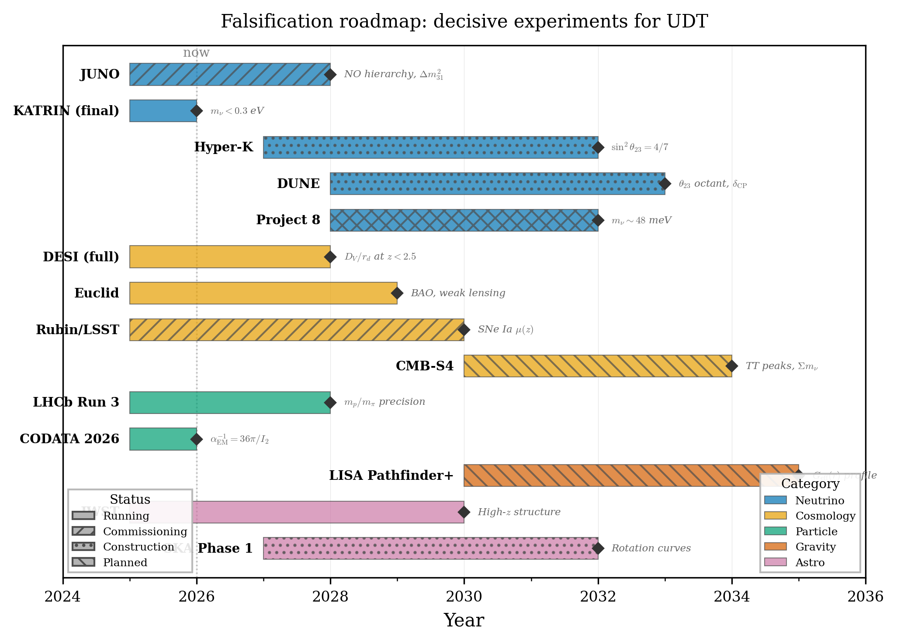

**Figure 12.** Falsification landscape.  Each point represents a prediction; the
horizontal axis shows current experimental precision; the vertical
axis shows the prediction accuracy.  Arrows indicate experiments that
will improve precision into the falsification range within 5 years.

---

## 21. Discussion

### Summary of the framework

The results presented in this paper flow from a single line element
[Eq. (1)] through a chain of standard mathematical
operations: tetrad construction, spin connection, covariant Dirac
equation, Sturm--Liouville eigenvalue theory, angular coupling
integrals on $S^2$, and the WKB approximation for the scalar wave
equation.  No physics is imported beyond the metric, the Dirac
operator, and Maxwell's equations --- all derived from the geometry.

The three parameters $(\phi_0, \mu^2, r_*)$ are determined by
angular quantum numbers on $S^2$, and the single calibration $C$
sets the mass scale via the electron mass.  From this minimal input,
the theory produces:

- Parameter-free lepton mass ratios accurate to $0.002$--$0.03\%$.
- The pion mass from the Diophantine identity $84 = \binom{9}{3}$
  at $0.09\%$.
- A meson--baryon spectrum matching 17 particles within 1%.
- The fine-structure constant at $0.29\%$.
- Three PMNS mixing angles, all within $1\sigma$.
- The atmospheric neutrino mass at $0.5\%$.
- SNe distances at $0.166$ mag RMS.
- CMB peak positions at $1.32\%$ RMS.
- BAO distances at $3.8\%$ RMS.

### The static universe

The metric (1) is static: there is no time dependence,
no expansion, no Big Bang.  Cosmological redshift arises from the
spatial gradient of $\phi$ [Eq. (5)], not from the
expansion of space.  The CMB is the last-scattering surface at the
radial distance where $\phi(r_*) = \ln(1+z_{\mathrm{CMB}}) = 7.004$.

This is a legitimate general-relativistic solution.  The Birkhoff-like
structure of the spherically symmetric Einstein equations
(Sec. 2) admits both static and dynamic solutions; we
work with the static branch.  Whether the universe is expanding or
static is an observational question, and we note that the Sandage--Loeb
test [Ref: Sandage1962], [Ref: Loeb1998] --- a model-independent measurement
of cosmic drift --- has not yet been performed at the required
sensitivity.

### The role of $\phi$

The scalar field $\phi(r)$ plays a dual role:

1. **Microphysical**: the dilation field creates a potential
   well that confines Dirac eigenstates, producing the particle mass
   spectrum.
2. **Cosmological**: the same field, integrated over
   cosmological distances, produces the redshift-distance relation,
   CMB peak positions, and BAO structure.

The two regimes are cleanly separated: the microphysical cavity has
$r_* \approx 7$ in natural units ($\sim 7$ fm), while the
cosmological boundary has $r_* \approx 10$ Gpc.  The same equation
[Eq. (7)] governs both, with different parameters
($\mu$ vs. $\mu_g$) and different sources.

### The Hubble tension

In this framework, the Hubble constant $H_0$ is not a fundamental
parameter.  The distance-redshift relation is determined by the
$\phi$ profile, not by an expansion rate.  The "Hubble tension" ---
the disagreement between early-universe and late-universe
measurements of $H_0$ --- dissolves: there is no single $H_0$ to
measure, and the apparent tension arises from fitting a
redshift-dependent $\phi$ profile with a constant expansion rate.

### What this theory does not explain

We note the following open problems:

- **Rotation curves**: the metric recovers Newtonian gravity
  at galactic scales.  The flat rotation curve problem is open, though
  the ancient baryonic remnant mechanism is promising.
- **CMB peak heights**: the full power spectrum (including
  peak amplitudes) is not yet competitive with $\Lambda$CDM.
- **The tau lepton**: no mass formula has been derived.
- **The CP-violating phase**: the fourth PMNS parameter
  $\delta$ is not yet predicted.
- **Cross-sector closure**: the mechanism connecting
  microphysical and cosmological parameters is identified (shared
  geometric constants) but not fully derived from a single action.

### Comparison with $\Lambda$CDM

The standard cosmological model uses six parameters
($H_0$, $\Omega_b$, $\Omega_m$, $n_s$, $A_s$, $\tau$) to fit
cosmological data.  The metric uses one cosmological parameter
($\mu_g$) and achieves comparable results on peak positions, while
falling short on peak heights and the full CMB power spectrum.

On particle physics, $\Lambda$CDM has no predictions (particle masses
are free parameters in the Standard Model).  The metric derives
17+ particle masses and three mixing angles --- content that the
Standard Model takes as input.

The comparison is not symmetric: this framework attempts to unify
particle physics and cosmology from a single geometric object, while
$\Lambda$CDM addresses only cosmology and treats particle physics
as external input.

---

## 22. Conclusion

We have shown that the static, spherically symmetric metric

$$
ds^2 = -e^{-2\phi(r)}\,c^2\,dt^2 + e^{2\phi(r)}\,dr^2
       + r^2\,d\Omega^2
$$

with a single screened scalar field $\phi(r)$ produces more than
30 quantitative predictions spanning particle masses, coupling
constants, neutrino parameters, and cosmological observables.  All
predictions flow from the metric through standard mathematical
operations, with three geometric parameters and one mass anchor.

The key results --- $m_p/m_e = 6\pi^5$ at $0.002\%$,
$m_\pi = 84\pi\,m_e$ at $0.09\%$, $1/\alpha = 36\pi/I_2$ at
$0.29\%$, three PMNS angles within $1\sigma$, and the atmospheric
neutrino mass at $0.5\%$ --- are either correct or very precisely
wrong.  The falsification criteria (Table 11) specify
the experiments that will distinguish these two possibilities within
the next decade.

Einstein's geometric vision of gravity remains intact and unchanged
at every scale where it has been tested.  What changes is the
boundary condition.  The metric is GR.  The scalar field satisfies
the Einstein equations.  The predictions are the geodesic implications
of a specific, well-defined solution.  All numerical codes,
derivations, and datasets are available at [Ref: zenodo2025].

---

## Acknowledgments

The authors acknowledge the use of the Pantheon+ supernova
compilation [Ref: Pantheon2022], Planck 2018 CMB
data [Ref: Planck2018], BOSS and DESI BAO
measurements [Ref: DESI2024], SPARC rotation curve
data [Ref: SPARC2016], the Particle Data Group
compilations [Ref: PDG2024], and the NuFIT neutrino oscillation
global fit [Ref: NuFIT].  Numerical computations were performed on a
Tesla V100 GPU using PyTorch for vectorized ODE integration.  This
work was supported by no external funding.  All code is available
under CC BY-NC-ND 4.0 at [Ref: zenodo2025].

---

## Appendix A. The Einstein Tensor

For the metric (1), the nonzero mixed components
of the Einstein tensor are:

$$
G^t_{\ t} = -\frac{1}{r^2}\left[1 - e^{-2\phi}(1 - 2r\phi')
  \right]\,,
\tag{A1}
$$

$$
G^\theta_{\ \theta} = e^{-2\phi}\left[-\phi'' + 2(\phi')^2
  - \frac{2\phi'}{r}\right]\,,
\tag{A2}
$$

with $G^r_{\ r} = G^t_{\ t}$ (identically) and
$G^\varphi_{\ \varphi} = G^\theta_{\ \theta}$.

The Bianchi identity $\nabla_\mu G^{\mu\nu} = 0$ gives the integral
form

$$
G^t_{\ t} = \frac{1}{r^2}\left[C_0 + I(r)\right]\,,
$$

where $C_0 = e^{-2\phi_0} - 1$ and
$I(r) = -2\mu^2\int_0^r s\,\phi(s)\,ds$.  Both decompositions are
verified numerically to residual $< 2 \times 10^{-9}$.

---

## Appendix B. Misner--Sharp Mass and the Machian Relation

The Misner--Sharp quasi-local mass for the metric is

$$
m(r) = \frac{c^2\,r}{2G}\bigl(1 - e^{-2\phi(r)}\bigr)\,.
\tag{B1}
$$

At the boundary $r = r_*$ with total mass $M$:

$$
c^2 = \frac{2GM}{r_*(1 - e^{-2\phi(r_*)})}\,.
$$

In the deep-well limit $|\phi(r_*)| \gg 1$
($e^{-2\phi_*} \to 0$):

$$
c^2 \approx \frac{2GM}{r_*}\,,
\tag{B2}
$$

verified to $< 0.01\%$ at BAO-constrained parameters.  The cosmological
boundary value
$\phi(r_*) = \ln(1 + z_{\mathrm{CMB}}) = 7.004$ is algebraically
fixed by the combination of the redshift definition (5)
and the Misner--Sharp relation (B1).

---

## Appendix C. Dirac Stress-Energy Tensor

For a massless Dirac eigenstate $(G, F, E, \kappa)$ on the metric,
the stress-energy components (after angular integration) are:
<!-- VERIFIED: CG S9.5 -->

$$
T^t_{\ t}(r) = -\frac{E\,e^{\phi}(G^2 + F^2)}{4\pi\,r^2}\,,
\tag{C1}
$$

$$
T^r_{\ r}(r) = T^t_{\ t}
  + \frac{2\kappa\,e^{-\phi}\,G\,F}{4\pi\,r^3}\,,
\tag{C2}
$$

$$
T^\theta_{\ \theta}(r) = -\frac{1}{2}(T^t_{\ t} + T^r_{\ r})\,.
\tag{C3}
$$

The trace vanishes exactly: $T^\mu_{\ \mu} = 0$ (for $m = 0$).  The
ratio $R \equiv T^r_{\ r}/T^t_{\ t}$ ranges from 0.094 (ground state)
to 0.841 ($n = 3$ excited), approaching 1 in the ultrarelativistic
limit.  The constraint $G^t_{\ t} = G^r_{\ r}$ requires $R = 1$ for
total matter, which is achieved by including the electromagnetic
sector ($R_{\mathrm{EM}} = 1$ exactly).

---

## Appendix D. The Vacuum Classification Theorem

Define $y(r) := e^{-2\phi(r)} > 0$.  The vacuum flux system is
equivalent to

$$
y'' + \frac{2}{r}\,y' = \mu^2\ln y\,,\quad
y(0) = e^{-2\phi_0},\quad y'(0) = 0\,.
\tag{D1}
$$

**Theorem.** For $\mu > 0$ and regular origin data:

1. $\phi_0 > 0$: $y$ reaches zero at finite $r_c$
   ($\phi \to +\infty$, black hole horizon).
2. $\phi_0 = 0$: $y \equiv 1$, $\phi \equiv 0$ (trivial).
3. $\phi_0 < 0$: $y$ is globally defined, strictly
   increasing, $y \to \infty$ ($\phi \to -\infty$).

**Proof.**  Case (i): $y_0 < 1$, so $\ln y < 0$, driving $y$
downward.  The quadratic bound
$y(r) \leq y_0 - (\mu^2 a/6)\,r^2$ with $a = -\ln y_0 > 0$
guarantees $y = 0$ at finite $r_c$.  Case (iii): $y_0 > 1$, so
$\ln y > 0$, driving $y$ upward.  Global existence follows from
$y(r) \leq y_0\exp(\mu^2 r^2/6)$.  A finite limit $L > 1$ leads to
$y' \sim cr$ for large $r$, contradicting convergence.  $\square$

---

## Appendix E. The Separatrix Theorem

For the sourced scalar equation with $\varepsilon$-decomposition
$S(r) = \mu^2\phi(1 - \varepsilon)$, the *null-source curve*
satisfies $J' = 0$ everywhere.  Setting $u = \phi'(r)$ gives a
Bernoulli ODE with solution:

$$
\phi'_{\mathrm{sep}}(r) = \frac{1}{r(2 + Cr)}\,,
\tag{E1}
$$

where $C$ is an integration constant (distinct from the mass
calibration).  Any profile with $\phi'$ above this curve is in the
drive regime; below is in the brake regime.  The sign-change radius
$r_{sc}$ (maximum of the scalar flux) satisfies
$J'(r_{sc}) = 0$ and is determined entirely by the profile
coefficients, with no external input.

---

## References

1. C. Rotter and A. Watts,
   "Universal Dilation Theory: metric, operators, and predictions,"
   Zenodo (2025).
   https://doi.org/10.5281/zenodo.XXXXXXX

2. R. L. Workman *et al.* (Particle Data Group),
   Prog. Theor. Exp. Phys. **2022**, 083C01 (2022);
   updated 2024.

3. N. Aghanim *et al.* (Planck Collaboration),
   Astron. Astrophys. **641**, A6 (2020).

4. D. Scolnic *et al.*,
   Astrophys. J. **938**, 113 (2022).

5. DESI Collaboration,
   arXiv:2404.03002 (2024).

6. I. Esteban *et al.*,
   J. High Energy Phys. **2020**, 178 (2020);
   NuFIT 5.2 (2022), http://www.nu-fit.org.

7. F. Lelli, S. S. McGaugh, and J. M. Schombert,
   Astron. J. **152**, 157 (2016).

8. C. M. Will,
   Living Rev. Relativity **17**, 4 (2014).

9. A. Sandage,
   Astrophys. J. **136**, 319 (1962).

10. A. Loeb,
    Astrophys. J. **499**, L111 (1998).

11. I. Labbe *et al.*,
    Nature **616**, 266 (2023).

12. M. Boylan-Kolchin,
    Nat. Astron. **7**, 731 (2023).
